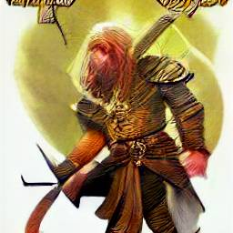

# D&D and text-to-image generation

Machine learning models for generating images from text prompts have significantly improved over the last few years. These models process a large data of images with captions, and encode knowledge about the world and language statistically. Once trained, these models may be presented with a text prompt and they will create an original image on demand. Here we have some fun by trying to elict how much knowledge of the world of roleplaying games, and specifically *Dungeons and Dragons*, one of these models can capture.

## The model

We play with [DALL-E Mini](https://github.com/borisdayma/dalle-mini), an open-source implementation of a text-to-image model. All the examples have been generated using the [Hugging Face](https://huggingface.co/) Space for [DALL-E Mini](https://huggingface.co/spaces/dalle-mini/dalle-mini). Details about the model, the training dataset and the training process are available [online](https://wandb.ai/dalle-mini/dalle-mini/reports/DALL-E-Mini-Explained-with-Demo--Vmlldzo4NjIxODA). All the images were generated on the 29th May 2022; the examples below are normally cherry-picked out of nine possible images returned by the model.

## Interacting with the model

We start with simple queries aimed at establishing whether the model has any knowledge of classical D&D categories. 

### Beholders and kobolds
An easy starting point are D&D monsters: they have highly distinctive names and, at least for some of them, a quite well-established appearance [1]. We query: *a band of kobolds fight against a beholder*.

The model seems to have an understanding of what a beholder might be (a large floating ball with sharp teeth and pseudopods); kobolds, when drawn, are in an approximately right scale, but very sketchy.

### Edition wars
Although certain monsters, like beholders, preserve their traits across editions, we know that their style evolved through years ([1] pgs 40-41). We examine if the model has any awareness of this. First we ask for a current-day creature: *a picture of a fifth edition beholder*

And then we ask for an older ancestor: *a picture of a first edition beholder*

At first sight, it is hard to notice a difference that may lead to attribute these images to one edition instead of another; all images seem reasonably *modern*.

### Back in time

The failure to generate images that clearly belong to one era instead of another may be due to the fact that the captions used to train the model rarely report information about *editions*. We wonder if, instead, the year in which an image was produced is more likely to be in the training caption. We test this idea querying for: *a picture of a d&d beholder (1980)*

.png)2.png)

The model now introduces a more archaic feel with an almost black-and-white rendition.

### Artist style

Another sort of information conveyed by captions is often the name of the illustrator. This could allow us to request an image in a style that is distinctive of a certain artist [1]. We first tried with *a picture of a beholder by Larry Elmore*: 

The specific style seems to be captured mainly in the addition of a new rich background, which may be vaguely reminiscent of a *Dragonlance* setting.

We then tried with another artist with his own distinctive style: *a picture of a beholder by Tony DiTerlizzi*

The style is markedly different now, with clear dark traits and limited use of color. Once again, though, it is probably the desolate planar landscape that may recall the *Planescape* setting.

Finally, we query *a picture of a beholder by Erol Otus*:

However, the model seems to rollback to a basic style, hardly capturing the surrealist style [1] of the artist.

Of course, we do not have to ask for a fantasy author: *a picture of a beholder by Picasso*:

These images clearly capture the feeling of the Spanish artist, not only because of his distinctive style, but also, very likely, because the dataset contains a larger samples of works by Picasso.

### Other formats

Always remaining on the topic of monsters, we test the model by requesting other types of representations. We start with portraits: *portrait of a lich* 

We get both a close-up and a full-body portrait that clearly convey the undead nature of the subject.

Another format is a 3D miniature: *miniature of Demogorgon*

The image does a good job at portraying a miniature. It depicts the long arms of the D&D demon prince, but the picture owes its head, at least in one case, to *Stranger Things* lore.

### D&D lexicon
So far the model has fared pretty well: it has been able to generate relevant images when provided with prompts that contained specific D&D keywords without external knowledge being provided; it showed that it connected the string *beholder* to a flying aberration, or the string *lich* to an undead. However this success is probably to be ascribed to the distinctive lexicon of D&D forming its own niche. When trespassing this domain, D&D content and references may be lost, as in the case of Demogorgon, where the model returned the image of a creature belonging to a different imaginary universe. Even if we try to make our request more explicit, results are similar: *miniature of D&D Demogorgon*

After all, the string *D&D* belongs once again to the lore of *Stranger Things*, and the model is not able to disentangle the two representations. The bias of the model towards *Stranger Things*'s Demogorgon is probably due to a larger number of samples in the dataset. With negation not understood by the model, it is hard to provide the model with enough direction to rectify this.

### Travelling in other lands

Success with creatures, does not transfer straightforwardly to other queries. If we ask about famous locations, we get at best vague renditions. For instance, we could ask *a view of castle Ravenloft*:

Probably the keyword *Ravenloft* is responsible for the gloomy atmosphere, but the castle is pretty generic.

Similarly, if we request *a photorealistic view of the city of Sigil*:

We get an endless sprawl which could recall the city of Sigil, but real fans may be skeptic about it (especially the blue sky!)

### Back to the real world
We can also probe the model about its knowledge of D&D in the real world. This could also end up returning and highlighting biases present in the original training data set. If we ask for *a group of friends playing D&D*, we get:

This probably shows an understanding of D&D as a generic boardgame, as the emphasis on board, maps and components suggest.

### Predicting the future

Finally, we take a look into the crystal ball. The model has no ability to predict the future, but we still seek an oracular response: *cover of the next D&D handbook*

Interpretation left to the reader!

### Timeout fails

It is worth reporting that some input prompts did not lead to an output in a reasonable time (arbitrarily set to 600 seconds). We experienced this in the following cases:

- Very specific request, e.g.: *miniature of demon prince D&D Demogorgon*
- Query based on proper nouns, e.g.: *a view of Baldur's Gate*, *Elminster crossing the Spine of the World*
- Conditional statements, e.g.: *if I were a kobold, I would...*

### Epic fails

Equally interesting, and perhaps more funny, are the failure cases of the model. 

For instance, the result of *Mialee casting a magic missile* was:

*Mialee* is probably too rare a name to convey any bias towards D&D, and *magic missile* is not a specific enough keyword.

The result improved a little bit making explict the connection with magic and requesting *a wizard casting a magic missile*:

However, the wizard remains very non-descriptive, and a missile or its effect are forced into the image.

Even when requesting a beholder, the model may fall back on the standard meaning of beholder, if the context of D&D is not made explicit; if, instead of requesting, *a picture of a d&d beholder (1980)*, we ask for *a picture of a beholder (1980)*, we would end up with:

.png)

A frame from a 1980s-like movie!

Actually all the above are not technically failures of the model, but just the discrepancy between our expected interpretation of the prompt and the average or common-sense meaning of the prompt. After all, without context, the model has no way to infer that our queries should be given meaning within the world of D&D. 

## Bibliography

[1] Witwer, Michael, et al. Dungeons & Dragons Art & Arcana: A Visual History. Ten Speed Press, 2018.